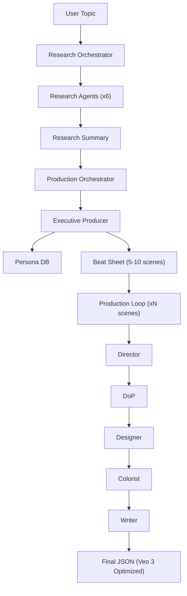

# AI Video Production Pipeline: Solution Architecture

## 🚀 System Overview
A multi-agent "Production House" system designed to transform research topics into high-fidelity, cinema-grade video sequences optimized for Google's **Veo 3** model.

## 🏗️ Core Components

### 1. Research Intelligence Layer
A 6-agent cluster that performs deep-dive investigation:
- **Data Miner:** Quantitative evidence and statistics.
- **Grassroots Voice:** Real-world perspectives and testimonies.
- **Historian:** Root-cause analysis and historical context.
- **Trend Scout:** Viral hooks and audience sentiment.
- **Narrative Architect:** Story beats and theme extraction.
- **Lead Investigator:** Orchestrates the research cluster.

### 2. Production Agency Layer
A 6-agent "Director's Cut" team:
- **Executive Producer:** Sequence planning and persona generation.
- **Director (Nolan Protocol):** Subject anchors and kinetic action.
- **Designer (Environment Mesh):** PBR materiality and regional anchors.
- **DoP (Optical Stack):** Ray-tracing lighting and lens physics.
- **Colorist (Film Stack):** Film stock emulation and grain profiles.
- **Writer (Kobiyal):** Performance-driven Bengali dialogue and lip-sync markers.

### 3. Orchestration & Persistence
- **Direct Sequential Orchestrator:** Manages the linear token flow to maximize substantive output.
- **Persona DB (JSON):** Stores persistent character profiles to ensure visual/auditory continuity across scenes.
- **Output Manager:** Slug-based, timestamped storage with automated manifest tracking.

## 🔄 Data Flow

## 🛠️ Tech Stack
- **Core:** Python 3.10+
- **LLM:** Google Gemini 2.0 Flash (Experimental)
- **Storage:** Local JSON/Markdown + GCS Integration
- **Deployment:** Docker / GCP Cloud Run
