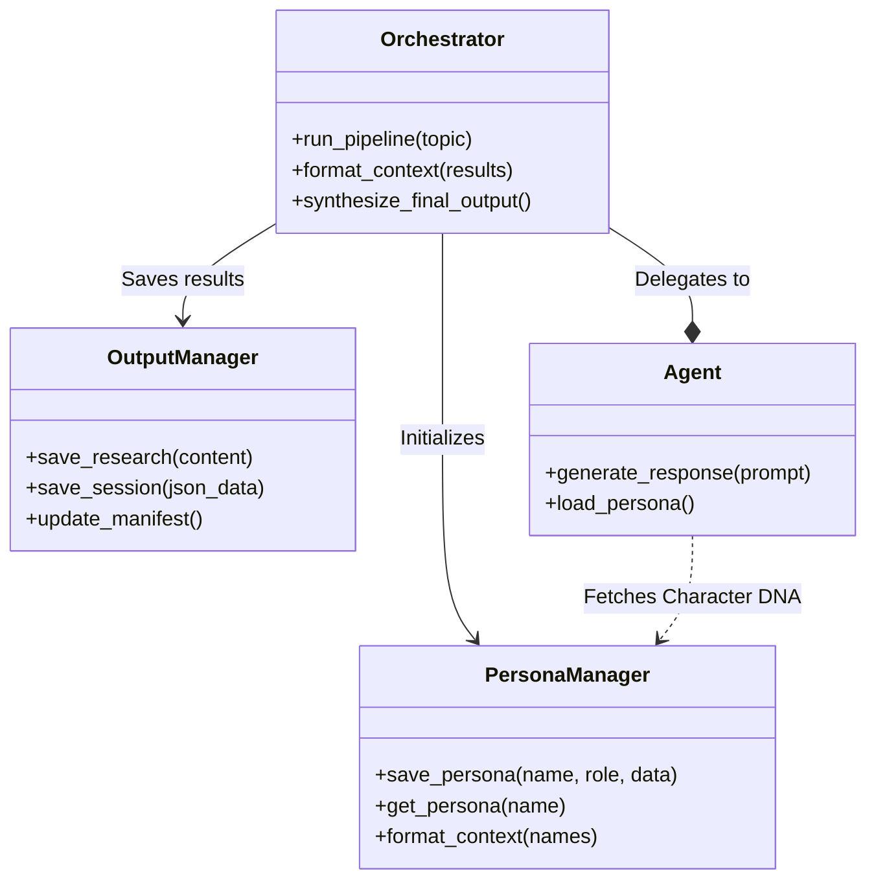
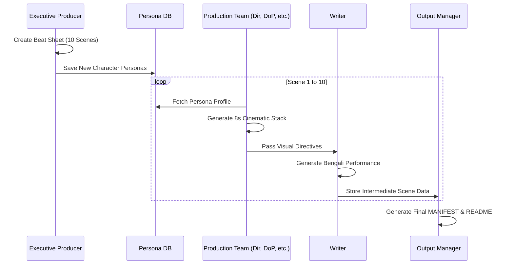

# UML Diagram: Agent Interaction & Persistence

## 🧬 Class Diagram (Conceptual)

```mermaid
classDiagram
    class Orchestrator {
        +run_pipeline(topic)
        +format_context(results)
        +synthesize_final_output()
    }
    class PersonaManager {
        +save_persona(name, role, data)
        +get_persona(name)
        +format_context(names)
    }
    class OutputManager {
        +save_research(content)
        +save_session(json_data)
        +update_manifest()
    }
    class Agent {
        +generate_response(prompt)
        +load_persona()
    }

    Orchestrator --> PersonaManager : Initializes
    Orchestrator --> OutputManager : Saves results
    Orchestrator --* Agent : Delegates to
    Agent ..> PersonaManager : Fetches Character DNA
```

## ⏱️ Sequence Diagram: Production Loop

```mermaid
sequenceDiagram
    participant EP as Executive Producer
    participant PDB as Persona DB
    participant Crew as Production Team (Dir, DoP, etc.)
    participant W as Writer
    participant OM as Output Manager

    EP->>EP: Create Beat Sheet (10 Scenes)
    EP->>PDB: Save New Character Personas
    Loop Scene 1 to 10
        Crew->>PDB: Fetch Persona Profile
        Crew->>Crew: Generate 8s Cinematic Stack
        Crew->>W: Pass Visual Directives
        W->>W: Generate Bengali Performance
        W->>OM: Store Intermediate Scene Data
    End
    OM->>OM: Generate Final MANIFEST & README
```
